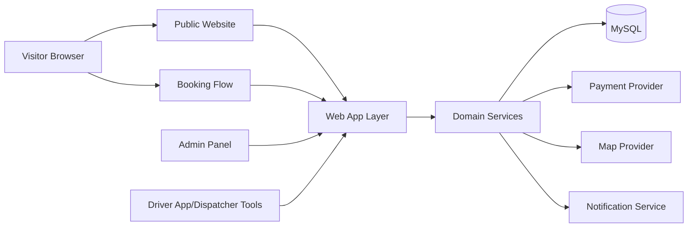
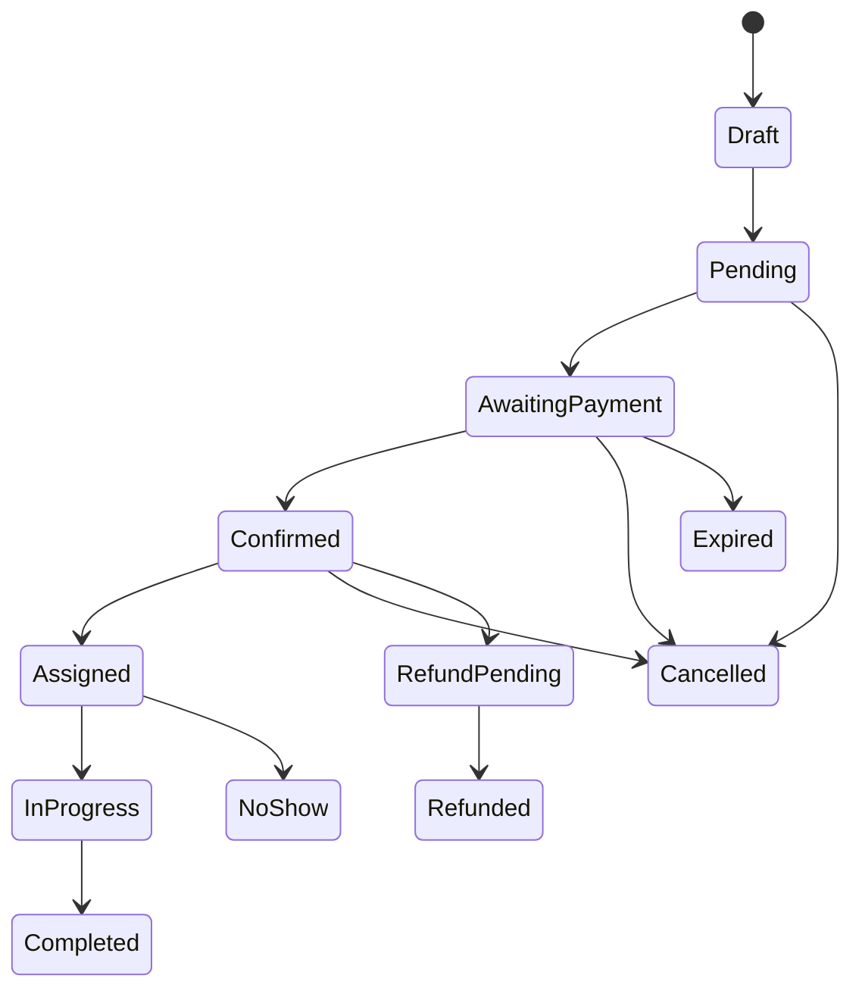

# Driver Transportation Website Template – Premium Edition

## 1. Project objective

This project is a premium, reusable transportation website template for taxi services, shared rides, intercity coach routes, limousine bookings, and premium travel services across Vietnam. It must support multi-brand deployment with a shared master codebase and tenant-level configuration.

The solution is designed around three priorities:

- Premium UX and commercial-quality design.
- Real booking workflow and operational business logic.
- Reusability through a template architecture, configuration-driven content, and role-based admin controls.

---

## 2. Scope and module map

### 2.1 Core business modules

1. Public marketing website
   - Home page
   - About
   - Services
   - Fleet
   - Routes
   - Pricing
   - Blog
   - Gallery
   - Reviews
   - Contact
   - Policy pages

2. Booking engine
   - Service selection
   - Route / trip search
   - Vehicle selection
   - Seat or bed selection
   - Customer data capture
   - Price summary
   - Payment workflow
   - Confirmation and status tracking

3. Operations & dispatch
   - Trip schedules
   - Vehicle assignment
   - Driver assignment
   - Route management
   - Booking status transitions
   - Operational notes

4. Admin dashboard
   - Booking management
   - Customers
   - Vehicles
   - Drivers
   - Routes and schedules
   - Pricing rules
   - Payment tracking
   - CMS content management
   - Settings and branding

5. Multi-tenant configuration layer
   - Brand name
   - Logo and theme
   - Service enablement
   - Route setup
   - Pricing configuration
   - Contact details
   - SEO settings

---

## 3. Recommended system architecture

### 3.1 High-level architecture

### 3.2 Recommended technology stack

Recommended stack for production deployment:

- Backend: PHP 8.2+ with Laravel 11
- Database: MySQL 8+
- Cache/session: Redis
- Frontend: Vite + JavaScript/TypeScript + Blade/Inertia or Laravel Livewire for admin and public templates
- Hosting: Linux + Nginx or Apache + SSL + cPanel-compatible deployment path
- Queue: Redis / worker queue for notifications, seat release, and async jobs

Why this stack:

- Strong ecosystem for commercial transport and admin workflows.
- Clear role-based authorization patterns.
- Easy deployment and maintenance for a multi-brand template.
- Good fit for booking logic, audits, and financial record keeping.

### 3.3 Template architecture

Each tenant should be able to run as a separate deployment or isolated site configuration. The shared codebase contains:

- Shared domain logic
- Shared UI components
- Shared booking engine
- Shared admin modules
- Tenant settings database
- Media storage access boundaries

Tenant-specific configuration includes:

- Brand identity
- Active services
- Route catalog
- Pricing policies
- Booking form fields
- Enabled sections and ordering
- Color palette and typography

---

## 4. Database design and schema foundation

### 4.1 Core tables

- users
- roles
- permissions
- user_role
- business_settings
- services
- service_config
- vehicles
- vehicle_types
- seat_layouts
- seats
- drivers
- routes
- pickup_points
- dropoff_points
- trip_schedules
- trips
- trip_seats
- customers
- bookings
- booking_passengers
- booking_seats
- booking_status_history
- pricing_rules
- booking_price_snapshots
- payments
- refunds
- reviews
- media
- pages
- blog_posts
- categories
- faqs
- notifications
- audit_logs

### 4.2 Data relationships

The critical relational rules are:

- One business has many services, vehicles, routes, trips, and bookings.
- One trip has many seat records and many bookings.
- One booking has many passengers, many price rows, and many payment entries.
- One booking status history record tracks each state transition.
- One vehicle can have one seat layout, but different service groups may use different layout variants.
- Routes can have multiple pickup/dropoff points and pricing configuration by vehicle type.

### 4.3 Seat and booking rules

Seat management must be server-side and concurrency-safe:

- Seat records are locked during booking creation.
- Seats can be held temporarily with expiry time.
- Booking creation uses database transactions.
- Duplicate seat assignment is prevented through unique constraints.
- A cancelled or expired booking releases reserved seats.
- Booking price is snapshotted at confirmation time.

---

## 5. Booking engine workflow

### 5.1 Booking lifecycle

### 5.2 Booking flow

1. Visitor opens website and selects service.
2. User inputs route, date, vehicle type, passenger count, and optional notes.
3. System searches available trips or sets up quote-based request.
4. User chooses a trip, route, or vehicle option.
5. Seat selection is validated by backend.
6. Customer fills personal data and chooses payment method.
7. System validates pricing and creates booking with snapshot.
8. Payment status is updated via payment confirmation or manual verification.
9. Admin confirms / assigns driver and vehicle.
10. Booking moves through operational status until completion.

---

## 6. Payment and financial logic

### Payment modes

- Cash
- Bank transfer
- Deposit
- Full payment
- Balance payment
- Online payment (future module)

### Payment policy

- No payment record should be treated as successful without validation.
- Manual transfer must be carefully verified by staff.
- Any online callback must verify signature, checksum, or secure token.
- Duplicate payments must be prevented and logged.
- Snapshot pricing protects historical bookings from future price changes.

---

## 7. Frontend screens and public pages

Required public pages include:

1. Home
2. About us
3. Services listing
4. Service detail
5. Route listing
6. Route detail
7. Pricing page
8. Fleet page
9. Vehicle detail
10. Trip search
11. Booking form
12. Seat selection
13. Passenger info
14. Booking confirmation
15. Payment
16. Booking result
17. Booking lookup
18. Blog listing
19. Blog detail
20. Gallery
21. Reviews
22. Contact
23. Policy
24. Terms
25. 404

These pages should be conditionally displayed based on enabled services and tenant configuration.

---

## 8. Admin dashboard module list

### 8.1 Dashboard

- Total bookings
- New bookings
- Pending confirmation
- Confirmed bookings
- Completed rides
- Canceled rides
- Revenue
- Paid vs outstanding
- Trip activity by day and month
- Top services and routes

### 8.2 Booking management

- Search and filter
- Status transitions
- Assign driver / vehicle
- Add internal notes
- Print booking summary
- Export CSV/Excel

### 8.3 Operations

- Route management
- Schedule creation
- Trip management
- Seat availability view
- Driver schedule validation
- Vehicle capacity assignment

### 8.4 Settings

- Branding
- Theme colors
- Logo and favicon
- Contact info
- SEO settings
- Homepage layout ordering
- Active service list

---

## 9. UX/UI strategy

### 9.1 Design direction

Modern Luxury Transportation – Premium Booking Experience.

Visual language:

- Luxury dark and premium navy palette
- Champagne accents for CTA and premium highlights
- Strong contrast and modern layout density
- Large hero media with cinematic overlays
- Premium cards and subtle glass or gradient overlays

### 9.2 Design tokens

- Color tokens: primary, secondary, surface, text, muted, accent, success, warning, danger
- Spacing scale
- Radius scale
- Shadow tokens
- Typography scale
- Motion tokens

### 9.3 Responsive behavior

- Mobile-first design
- Sticky mobile footer CTAs
- Collapsible navigation
- Tap-friendly form controls
- Horizontal route and pricing layouts optimized for small screens

### 9.4 Motion specification

- Use CSS-first transitions for common interactions
- Use GSAP only for premium hero and sectional reveals
- Respect prefers-reduced-motion
- Avoid heavy motion libraries for basic UI states

---

## 10. Security and operations requirements

The system must include:

- HTTPS only
- CSRF protection
- XSS prevention
- SQL injection safe queries via ORM / prepared statements
- Rate limiting
- Auth and permission control
- Secure file upload handling
- Audit logs for admin changes and payment events
- Backup and restore procedures
- Delivery of environment variables and secrets outside the repository

---

## 11. Implementation order

### Phase 1 – Product Analysis and system definition

- Requirement mapping
- Service model selection
- Business rules definition
- Tenant strategy
- Booking rule definition

### Phase 2 – Architecture and database design

- ERD and schema
- Booking states and transitions
- Security model
- Role and permission design

### Phase 3 – UI/UX design and component library

- Design tokens
- Wireframes
- Mobile and desktop layouts
- Motion pattern specification

### Phase 4 – Frontend development

- Homepage and marketing pages
- Booking form flow
- Route and pricing pages
- Mobile adaptation

### Phase 5 – Backend and business logic

- Authentication
- Booking engine
- Pricing engine
- Payment handling
- Notifications

### Phase 6 – Admin dashboard and CMS

- Dashboard analytics
- Booking management
- Vehicle and driver management
- Settings and content editing

### Phase 7 – Testing, performance, and security

- Booking concurrency testing
- Responsive QA
- Accessibility review
- SEO validation
- Payment verification

### Phase 8 – Deployment and documentation

- Hosting configuration
- SSL and environment setup
- Backups and recoveries
- Admin documentation and deployment notes

---

## 12. Delivery checklist

The completed solution must provide:

- Reusable master template architecture
- Premium public-facing design
- Full booking workflow
- Real operational admin dashboard
- Payment and pricing snapshot model
- Seat management with transactional safety
- Brand and theme configuration
- CMS and SEO support
- Documentation and deployment plan

---

## 13. Current project status

This repository currently includes the technical plan and a premium landing page prototype. The next stages will continue with a modular architecture, database schema, and implementation of the booking/admin foundation.
